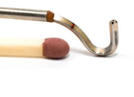

# MultiHole Probe Calibration Code
## Background
A 5 hole probe can measure flow direction in the pitch and yaw directions along with the total pressure and mach number - 5 Data points are used to predict 4. 

NASA has a page describing how they calibrate probes. 
[5 Hole Probe](https://www.grc.nasa.gov/www/k-12/airplane/tunp5h.html)

NASA either does their own calibration or when purchasing a probe from a manufacturer, the manufacturer provides the calibration. This code release demonstrates how to apply our machine learning strategy to train on the calibration data. AND how to use the model to predict the flow angles (Pitch, Yaw), Mach, and Cpt or ratio of total to static pressures. 

## Tutorials
[NASA 5 Hole Probe](tutorials/5HoleProbe/5HoleProbeTrain.ipynb)

> **_NOTE:_**  The aerodyne probe example shows how to calibrate all the probes if data is specified ina folder. Example: 16328-1, 16328-2, 16071-1. The 16328 and 16071 are probe model numbers. The -1, -2, ... -whatever is the probe number. So 16328-1 is a specific probe and the folder name contains all the calibration data for it. 

[Aerodyne 5 Probe](tutorials/AerodyneProbe/Aerodyne.ipynb)

# License
[NASA Open Source Agreement](https://opensource.org/licenses/NASA-1.3)